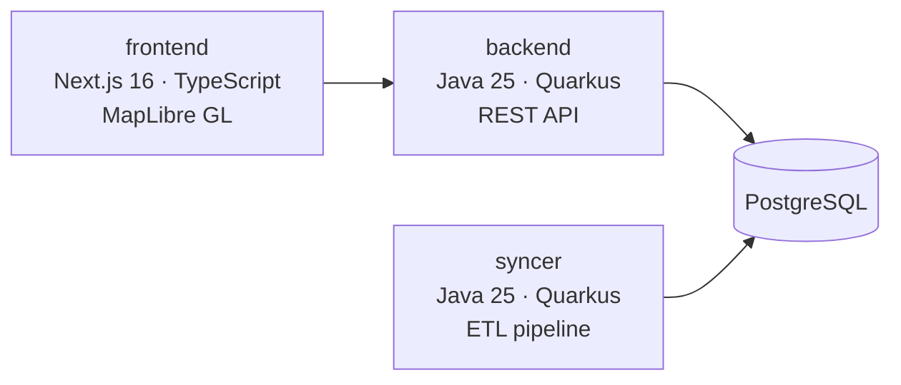

# Намери Детска

[](https://github.com/nameri-detska/nameri-detska/actions/workflows/ci-push.yml)


Намерете детски градини и ясли близо до вас в София — сортирани по разстояние, с интерактивна карта.

На живо на **[nameri-detska.com](https://nameri-detska.com)**

## Мотивация

Като родител в София получих имейл, че детето ми не е прието на първо класиране. Търсенето на алтернативи беше ненужно сложно: официалната система ИСОДЗ е трудна за навигация, списъкът с регистрирани частни ясли е заровен в PDF, а няма начин да сортирате заведенията по близост. Този проект демонстрира по-добро решение. Надяваме се, че ИСОДЗ ще възприеме тези подобрения и този сайт ще може да бъде спрян за постоянно.

## Архитектура



- **syncer** — Събира данни за заведения от три български държавни източника, извлича данни от PDF чрез Gemini AI, геокодира адреси чрез Google Maps и записва в PostgreSQL.
- **backend** — Quarkus REST API, обслужващо геокодирани данни за заведения с 1-часово кеширане.
- **frontend** — Next.js уеб приложение с интерактивна карта, търсене по адрес, филтриране по тип/собственост и сортиране по разстояние.

## Технологичен Стак

| Слой | Технология |
|---|---|
| Frontend | Next.js 16, React 19, TypeScript, Tailwind CSS v4, MapLibre GL, TanStack React Query |
| Backend | Java 25, Quarkus, PostgreSQL (JDBC), GraalVM native image |
| ETL | Java 25, Quarkus, Hibernate + Panache, LangChain4j Gemini, PDFBox, Google Maps API |
| CI/CD | GitHub Actions, Google Cloud Run, Artifact Registry |
| Build | Maven (Java), npm workspaces (frontend) |

## Първи Стъпки

### Предварителни Изисквания

- **Node.js 26+** (frontend)
- **JDK 25** (backend & syncer)
- **PostgreSQL** (backend & syncer)
- **Maven 3.9+** (Java builds)
- **Google Maps API ключ** (syncer геокодиране)
- **Google Gemini API ключ** (syncer извличане от PDF)

### Локално стартиране

1. **Настройка на PostgreSQL** — създайте база данни и таблица `kid_facility` (виж [backend/README.md](backend/README.md#database-setup)).
2. **Зареждане на данни** — стартирайте syncer за извличане и геокодиране на данните (виж [syncer/README.md](syncer/README.md)).
3. **Стартиране на backend** — `cd backend && mvn quarkus:dev` (работи на порт 8080).
4. **Стартиране на frontend** — `cd frontend && npm run dev` (работи на порт 3000).

Отворете [http://localhost:3000](http://localhost:3000).

### Docker

Всеки компонент има собствен Dockerfile. Виж README файловете на отделните компоненти за инструкции.

## Структура на Проекта

```
nameri-detska/
├── frontend/        # Next.js 16 уеб приложение
├── backend/         # Quarkus REST API
├── syncer/          # ETL pipeline за данни
├── .github/         # CI/CD workflows & Dependabot
├── .formatter/      # Java кодови конвенции (споделени)
├── package.json     # npm workspace root
└── pom.xml          # Maven родителски POM
```

## Източници на Данни

| Източник | Тип | Линк |
|---|---|---|
| [ИСОДЗ](https://kg.sofia.bg) общински регистър | REST API | [`kg.sofia.bg/api/public/kg/...`](https://kg.sofia.bg/api/public/kg/type/kinderGarden/all?filterType=by_region&kgType=0&regionId=0) |
| Лицензирани частни ясли (СРЗИ) | PDF файл | [PDF](https://kg.sofia.bg/api/public/file/91f643b4bd6a4b179aaec3de09d028af) · [Източник: kg.sofia.bg/#/manual](https://kg.sofia.bg/#/manual) |
| [МОН публичен регистър](https://ri-api.mon.bg) на частни градини | REST API | [`/public-register`](https://ri-api.mon.bg/data/get/public-register) + [`/institution`](https://ri-api.mon.bg/data/get/institution) |
| Адресно геокодиране (потребители) | [Nominatim](https://nominatim.org/) (OpenStreetMap) | |
| Адресно геокодиране (заведения) | [Google Maps Geocoding API](https://developers.google.com/maps/documentation/geocoding/overview) | |
| Изчисляване на разстояния | [Haversine формула](https://en.wikipedia.org/wiki/Haversine_formula) | |

## Принос

1. Форкнете хранилището
2. Стартирайте `mvn spotless:apply` преди къмитване на Java промени, за да отговарят на кодовия стил на проекта
3. Отворете pull request към `main`

Правилата за форматиране на кода са в `.formatter/`.

## Лиценз

MIT — виж README на всеки компонент за детайли.
